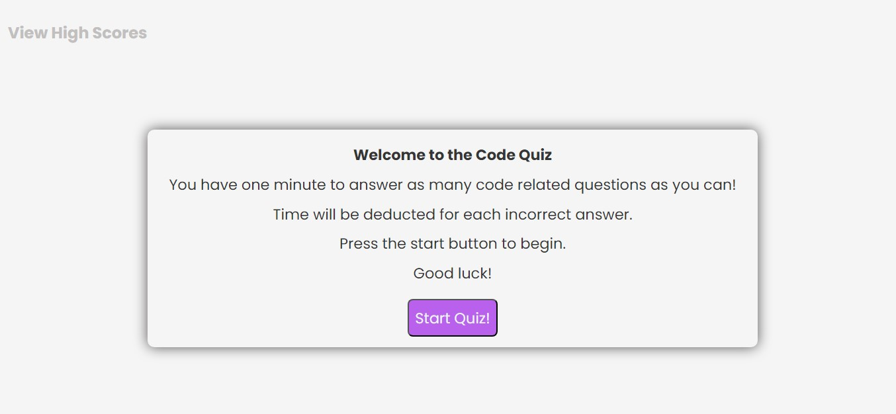

# week-4-code-quiz-challenge

## Purpose of Task

Creation of a coding quiz. There will be a welcome page introducing the player to the quiz, the quiz itself which will have multiple coding related questions, a results page where the player can enter their name and save their score and finally a high scores page which will make use of local storage to display saved scores ordered from highest to lowest. The page will make use of HTML, CSS and JavaScript and will be responsive in its design.

## User Story

```
AS A coding boot camp student
I WANT to take a timed quiz on JavaScript fundamentals that stores high scores
SO THAT I can gauge my progress compared to my peers
```

## Acceptance Criteria

```
GIVEN I am taking a code quiz
WHEN I click the start button
THEN a timer starts and I am presented with a question
WHEN I answer a question
THEN I am presented with another question
WHEN I answer a question incorrectly
THEN time is subtracted from the clock
WHEN all questions are answered or the timer reaches 0
THEN the game is over
WHEN the game is over
THEN I can save my initials and my score
```

## Problems Solved

- When the **Start Button** is clicked, the welcome page is hidden and the quiz page is displayed along with the timer
    - The timer immediately begins counting down from 75
- The player is presented with four choices, and after choosing an answer they are moved on to the next question
    - If the player chooses correctly a message pops up saying Correct! and their score increases by 20
    - If the player chooses incorrecty a message pops up saying Wrong!, their score decreases by 9 and the time remaining decreases by 20 seconds
- The game ends once all questions are answered or if time has run out
- The user can then see their score, capped at a minimum of 0, and can then enter their initials and save their score into local storage by clicking the **Save Score** button
- If the user wishes to play again they can click the **Replay Quiz** button
- The user can then go to the high scores page by clicking the **View High Scores** button on the results page or by following the link in the top left of the page, the latter being accessible at any time
- The high scores page shows the saved scores from highest to lowest, and these can be cleared using the **Clear High Scores** button
- The user can then return to the welcome page by following the link in the top left of the page

## Screenshot

 

## Deployed Webpage

The published page is available here: https://olivercray.github.io/week-4-code-quiz-challenge/